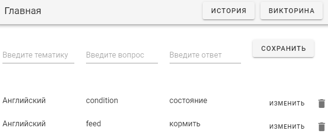
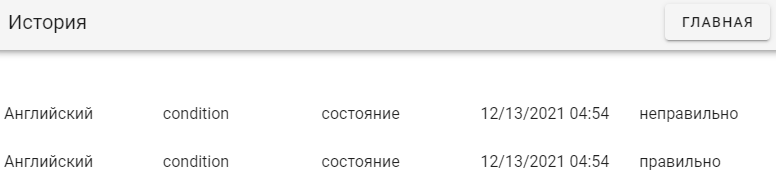
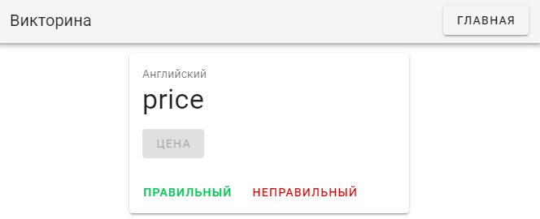
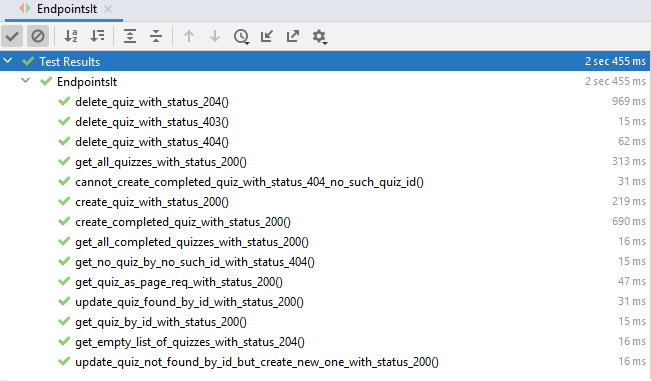
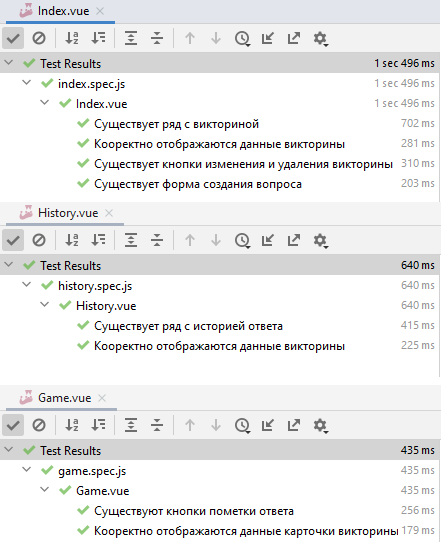
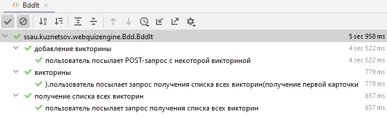
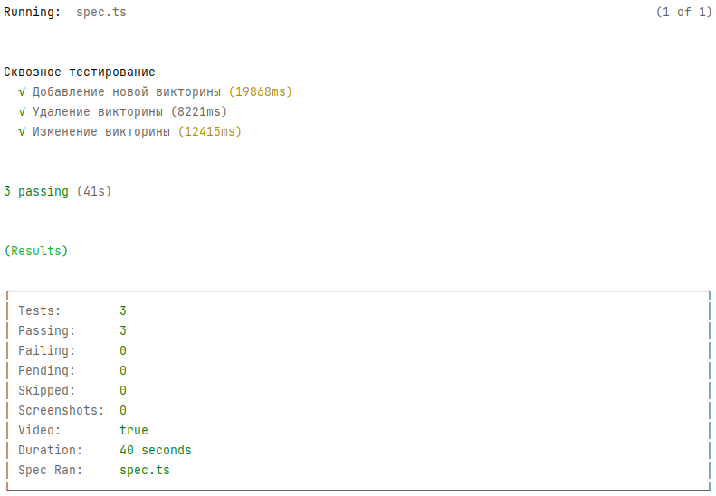

1. [Описание пользовательского интерфейса](#lab1)
2. [Развёртывание приложения](#lab6)
3. [Модульное тестирование серверной части системы](#lab2)
4. [Модульное тестирование клиентской части системы](#lab3)
5. [Интеграционное тестирование](#lab4)
6. [Сквозное тестирование](#lab5)
7. [API](#lab0)

## Описание пользовательского интерфейса <a name="lab1"></a>
Серверная часть приложения написана на языке Java при помощи фреймворков Spring Boot, клиентская часть – написана с помощью фреймворка Vue.js, в качестве СУБД используется PostgreSQL, обе части протестированы в среде разработки IntelliJ IDEA.

На главной странице пользователю представлен список вопросов и ответов по определённой тематике. Нажав на ссылку «Изменить», текст вопроса, тематики и ответа появляются в окнах ввода, в которых пользователь может изменить содержимое; чтобы сохранить ввод – нужно щёлкнуть по кнопке «Сохранить». По нажатию на иконку корзины запись удаляется из системы (при следующей загрузке страницы будет недоступна).



Щёлкнув по кнопке «История», пользователь переходит на соответствующую страницу. На странице представлена история ответов текущего пользователя, включая отметку верно ли дан был ответ (пользователь контролирует себя сам).



Для того, чтобы вернуться на главную страницу, нужно щёлкнуть по кнопке «Главная».

Щёлкнув по кнопке «Викторина», пользователь переходит на соответствующую страницу (рисунок 9). На этой странице пользователю отображаются все пары вопрос/ответ по одному разу, по окончанию викторины система переведёт пользователя на страницу истории ответов.

Пользователю отображается тематика вопроса, текст вопроса и кнопка «Получить ответ». По нажатию кнопки, на её месте отображается надпись с ответом на вопрос, ниже этой надписи появляются две кнопки. По нажатию на кнопку «Правильный», в системе создаётся историческая запись о том, что пользователь ответил правильно на этот вопрос в настоящий момент времени, по нажатию на «Неправильной» – в записи отмечается, что ответ был неправильным. По нажатию на любую из этих кнопок, отображается следующий вопрос.



## Развёртывание приложения <a name="lab6"></a>
Для тестирования приложения были развёрнуты два Docker-контейнера: контейнер приложения и контейнер СУБД PostgreSQL, с которым взаимодействует приложение.
*   файл Dockerfile – содержит настройки создания Docker-образа из .jar-файла приложения;
*   файл docker-compose.yml – в нём описаны образы и настройки развёртывания;
*   файлы vars-postgres.env и vars-spring.env – в них описаны переменных среды, которые использует docker-compose при развёртывании контейнеров;
*   файлы 1-up.bat и 2-down.bat – предназначены для запуска и остановки Docker-контейнеров.

Также в приложении А представлен исходный код файла application-test.properties – этот файл содержит настройки для запуска тестов, которые будет обращаться к приложению и база данных, развёрнутым в Docker-контейнерах.

## Модульное тестирование серверной части системы <a name="lab2"></a>
Было реализовано модульное тестирование серверной части при помощи фреймворков JUnit и Mockito
Были разработаны 14 автоматизированных тестов. Тесты проверяют работу конечных точек (endpoints) серверной части приложения. Всего тестируемых конечных точек – 8, для каждой реализован один тест, который проверяет ответ (в формате JSON) на GET-запрос в случае корректных данных запроса. Запросы к прочим подсистемам “мокируются” – запросы к базе данных и запросы к системе авторизации – перед запросами к этим подсистемам создаются их моки.



## Модульное тестирование клиентской части системы <a name="lab3"></a>
Клиентская часть системы написано на фреймворке Vue.js. Модульное тестирование этой части системы реализовано с помощью фреймворка Jest.
Были протестированы три компонента подсистемы: Vue-компонент главной страницы, страницы истории и страницы игры (викторины).



## Интеграционное тестирование <a name="lab4"></a>
Было реализовано тестирование приложения через поведение.

Были разработаны три пользовательских сценария:
*   добавление викторины.feature
*   получение первой карточки.feature
*   получение списка всех викторин.feature

Фреймворк Cucumber использует класс BddSteps, в котором описаны шаги тестирования (BDD steps): шаги представляют собой некоторые действия, которые выполняет фреймворк в соответствии с пользовательским сценарием. Описание шагов – это методы, написанные на языке Java и помеченные специальными аннотациями @Before, @Given, @When и @Then, на которые обращает внимание фреймворк Cucumber.

В начале каждого сценария база данных очищается – удаляются все записи всех таблиц, и в зависимости от так называемого шага Given, который означает начальное условие, в базу данных добавляются некоторые данных. Начальные условия задаются с использование объекта класса AdminHttpClient и контроллера приложения AdminController; “пользователь” сценариев посылает HTTP-запросы приложению при помощи объекта класса UserHttpClient.



## Сквозное тестирование <a name="lab5"></a>
Были реализованы тесты для сквозного тестирования разработанной системы. В качестве фреймворка для тестирования использовался Cypress.

Сквозные тесты приложения:
*   добавление викторины: пользователь вводит в поля ввода тематику, вопрос и ответы викторины, затем нажимает на кнопку «Сохранить», викторина отображается в списке викторин;
*   удаление викторины: пользователь добавляет викторину, затем удаляет её по нажатию на иконку корзины, викторина удаляется из системы и отсутствует в списке викторин;
*   изменение викторины: пользователь добавляет викторину, затем нажимают на кнопку «Изменить», тематика, вопрос и ответ изменяемой викторины отображены в полях ввода, пользователь меняет эти данные, затем нажимает на кнопку «Сохранить», изменения викторины отображены в списке викторин.



## API <a name="lab0"></a>
A simple engine for creating and solving quizzes through HTTP API.

### Running the application
Docker image

### Description
The service API supports creating, getting, and solving quizzes.
Each quiz has an id, title, text, some options. Some of the options are correct (from 0 to all).
The answer is not returned in the API.

### Operations and their results
To perform any actions with quizzes a quizUser has to be registered and then authorized via HTTP Basic Auth.
Otherwise, the service returns the `HTTP 401 (Unauthorized)` code.

---

### Register a new quizUser
To register a new quizUser, you need to send a JSON with `email` and `password` via `POST` request.

The service returns 200, if the registration has been completed successfully.

If the email is already taken by another quizUser, the service will return `HTTP 400`.

Here are some additional restrictions to the format of quizUser credentials:
- an email must have a valid format (with `@` and `.`);
- password must have at least five characters.

If any of them are not satisfied, the service will also return `HTTP 400`.

All the following operations needs a registered quizUser to be successfully completed.

---

### Create a new quiz
To create a new quiz, you need to send a JSON via `POST` request with the following keys: 
- `title`: string, required;
- `text`: string, required;
- `options`: an array of strings, it's required, and should contain at least 2 items; 
- `answer`: an array of indexes of correct options, it's optional since all options can be wrong.

The response contains the same JSON with generated `id`, but does not include `answer`.
```json
{"id":1,"title":"The Java Logo","text":"What is depicted on the Java logo?","options":["Robot","Tea leaf","Cup of coffee","Bug"]}
```

If the request JSON does not contain `title` or `text`, or they are empty strings (`""`), then the response is `404`.
If the number of options in the quiz is less than 2, the response is `404` as well.

---

### Get a quiz
To get an info about a quiz, you need to specify its `id` in url.

```
GET http://localhost:8889/api/quizzes/1
```

The response does not contain `answer`:
```json
{"id":1,"title":"The Java Logo","text":"What is depicted on the Java logo?","options":["Robot","Tea leaf","Cup of coffee","Bug"]}
```

If the quiz does not exist, the server returns `HTTP 404`.

---

### Get all quizzes (with paging)
The number of stored quizzes can be very large. 
In this regard, obtaining all quizzes is performed page by page: 10 quizzes at once.

```
GET http://localhost:8889/api/quizzes
```

The response contains a JSON with quizzes (inside `content`) and some additional metadata:

```json
{
"totalPages":1, "totalElements":3, "last":true, "first":true, "sort":{ }, "number":0, 
"numberOfElements":3, "size":10, "empty":false, "pageable": { },
"content":[
  {"id":102,"title":"Test 1","text":"Text 1","options":["a","b","c"]},
  {"id":103,"title":"Test 2","text":"Text 2","options":["a", "b", "c", "d"]},
  {"id":202,"title":"The Java Logo","text":"What is depicted on the Java logo?","options":["Robot","Tea leaf","Cup of coffee","Bug"]}]
}
```

We can pass the `page` param to navigate through pages `/api/quizzes?page=1`. 
Pages start from 0 (the first page).

If there is no quizzes, `content` is empty.

In all cases, the status code is `HTTP 200 (OK)`.

---

### Solving a quiz
To solve a quiz, you need to pass an answer JSON-array with option indexes via `POST` request.

It is also possible to send an empty array of options because some quizzes may not have correct options.

The result is determined by the value of the boolean `success` key in the response json.

- if the answer is correct:
```json
{"success":true,"feedback":"Congratulations, you're right!"}
```

- if the answer is incorrect:
```json
{"success":false,"feedback":"Wrong answer! Please, try again."}
```

- If the specified quiz does not exist, the server returns `HTTP 404`.

---

### Get all completions of quizzes (with paging)
The API provides an operation to get all completions of quizzes for a quizUser.
A response is separated by pages, since the service may return a lot of data.

```
GET  http://localhost:8889/api/quizzes/completed
```

The response contains a JSON with quizzes (inside `content`) and some additional metadata:

```json
{
"totalPages":1,"totalElements":5,"last":true,"first":true, "empty":false,
"content":[
  {"quizId":103,"quizTitle":"Test 3","completedAt":"2019-10-29T21:13:53.779542"},
  {"quizId":102,"quizTitle":"Test 2","completedAt":"2019-10-29T21:13:52.324993"},
  {"quizId":101,"quizTitle":"Test 1","completedAt":"2019-10-29T18:59:58.387267"},
  {"quizId":101,"quizTitle":"Test 1","completedAt":"2019-10-29T18:59:55.303268"},
  {"quizId":202,"quizTitle":"The Java Logo","completedAt":"2019-10-29T18:59:54.033801"}]
}
```

Since it is allowed to solve a quiz multiple times, the response may contain duplicate quizzes, 
but with different completion date.

We removed some metadata keys from the response to keep it more simple to understand.

---

### Deleting a quiz
It is possible to delete a quiz, but this can only be done by its creator.

```
DELETE  http://localhost:8889/api/quizzes/1
```

If the operation was successful, the service returns `HTTP 204 (No content)`.

If the specified quiz does not exist, the server returns `HTTP 404`.
If the specified quizUser is not the creator of this quiz, the response contains `HTTP 403 (Forbidden)`.
