# Автоматизация тестирования программного обеспечения (2021)

1. [Описание API веб-приложения](#quizapi)
2. [Описание пользовательского интерфейса веб-приложения](#quizui)
3. [Описание развёртывания веб-приложения](#quizdevops)
4. [Модульное тестирование серверной части веб-приложения](#quizbackend)
5. [Модульное тестирование серверной части веб-приложений](#lab1)
6. [Модульное тестирование клиентской части веб-приложения](#quizfrontend)
7. [Интеграционное тестирование веб-приложения](#quizapp)
8. [Интеграционное тестирование веб-приложений](#lab2)

3. [Модульное тестирование](#lab3)
4. [Разработка через поведение](#lab4)
5. [Модульное тестирование фронтэнда](#lab5)
6. [Сквозное тестирование](#lab6)

## API <a name="lab0"></a>
A simple engine for creating and solving quizzes through HTTP API.

### Running the application
Docker image

### Description
The service API supports creating, getting, and solving quizzes.
Each quiz has an id, title, text, some options. Some of the options are correct (from 0 to all).
The answer is not returned in the API.

### Operations and their results
To perform any actions with quizzes a quizUser has to be registered and then authorized via HTTP Basic Auth.
Otherwise, the service returns the `HTTP 401 (Unauthorized)` code.

---

### Register a new quizUser
To register a new quizUser, you need to send a JSON with `email` and `password` via `POST` request.

The service returns 200, if the registration has been completed successfully.

If the email is already taken by another quizUser, the service will return `HTTP 400`.

Here are some additional restrictions to the format of quizUser credentials:
- an email must have a valid format (with `@` and `.`);
- password must have at least five characters.

If any of them are not satisfied, the service will also return `HTTP 400`.

All the following operations needs a registered quizUser to be successfully completed.

---

### Create a new quiz
To create a new quiz, you need to send a JSON via `POST` request with the following keys: 
- `title`: string, required;
- `text`: string, required;
- `options`: an array of strings, it's required, and should contain at least 2 items; 
- `answer`: an array of indexes of correct options, it's optional since all options can be wrong.

The response contains the same JSON with generated `id`, but does not include `answer`.
```json
{"id":1,"title":"The Java Logo","text":"What is depicted on the Java logo?","options":["Robot","Tea leaf","Cup of coffee","Bug"]}
```

If the request JSON does not contain `title` or `text`, or they are empty strings (`""`), then the response is `404`.
If the number of options in the quiz is less than 2, the response is `404` as well.

---

### Get a quiz
To get an info about a quiz, you need to specify its `id` in url.

```
GET http://localhost:8889/api/quizzes/1
```

The response does not contain `answer`:
```json
{"id":1,"title":"The Java Logo","text":"What is depicted on the Java logo?","options":["Robot","Tea leaf","Cup of coffee","Bug"]}
```

If the quiz does not exist, the server returns `HTTP 404`.

---

### Get all quizzes (with paging)
The number of stored quizzes can be very large. 
In this regard, obtaining all quizzes is performed page by page: 10 quizzes at once.

```
GET http://localhost:8889/api/quizzes
```

The response contains a JSON with quizzes (inside `content`) and some additional metadata:

```json
{
"totalPages":1, "totalElements":3, "last":true, "first":true, "sort":{ }, "number":0, 
"numberOfElements":3, "size":10, "empty":false, "pageable": { },
"content":[
  {"id":102,"title":"Test 1","text":"Text 1","options":["a","b","c"]},
  {"id":103,"title":"Test 2","text":"Text 2","options":["a", "b", "c", "d"]},
  {"id":202,"title":"The Java Logo","text":"What is depicted on the Java logo?","options":["Robot","Tea leaf","Cup of coffee","Bug"]}]
}
```

We can pass the `page` param to navigate through pages `/api/quizzes?page=1`. 
Pages start from 0 (the first page).

If there is no quizzes, `content` is empty.

In all cases, the status code is `HTTP 200 (OK)`.

---

### Solving a quiz
To solve a quiz, you need to pass an answer JSON-array with option indexes via `POST` request.

It is also possible to send an empty array of options because some quizzes may not have correct options.

The result is determined by the value of the boolean `success` key in the response json.

- if the answer is correct:
```json
{"success":true,"feedback":"Congratulations, you're right!"}
```

- if the answer is incorrect:
```json
{"success":false,"feedback":"Wrong answer! Please, try again."}
```

- If the specified quiz does not exist, the server returns `HTTP 404`.

---

### Get all completions of quizzes (with paging)
The API provides an operation to get all completions of quizzes for a quizUser.
A response is separated by pages, since the service may return a lot of data.

```
GET  http://localhost:8889/api/quizzes/completed
```

The response contains a JSON with quizzes (inside `content`) and some additional metadata:

```json
{
"totalPages":1,"totalElements":5,"last":true,"first":true, "empty":false,
"content":[
  {"quizId":103,"quizTitle":"Test 3","completedAt":"2019-10-29T21:13:53.779542"},
  {"quizId":102,"quizTitle":"Test 2","completedAt":"2019-10-29T21:13:52.324993"},
  {"quizId":101,"quizTitle":"Test 1","completedAt":"2019-10-29T18:59:58.387267"},
  {"quizId":101,"quizTitle":"Test 1","completedAt":"2019-10-29T18:59:55.303268"},
  {"quizId":202,"quizTitle":"The Java Logo","completedAt":"2019-10-29T18:59:54.033801"}]
}
```

Since it is allowed to solve a quiz multiple times, the response may contain duplicate quizzes, 
but with different completion date.

We removed some metadata keys from the response to keep it more simple to understand.

---

### Deleting a quiz
It is possible to delete a quiz, but this can only be done by its creator.

```
DELETE  http://localhost:8889/api/quizzes/1
```

If the operation was successful, the service returns `HTTP 204 (No content)`.

If the specified quiz does not exist, the server returns `HTTP 404`.
If the specified quizUser is not the creator of this quiz, the response contains `HTTP 403 (Forbidden)`.

## Описание пользовательского интерфейса <a name="quizui"></a>
Серверная часть приложения написана на языке Java при помощи фреймворков Spring Boot, клиентская часть – написана с помощью фреймворка Vue.js, в качестве СУБД используется PostgreSQL, обе части протестированы в среде разработки IntelliJ IDEA.

На главной странице пользователю представлен список вопросов и ответов по определённой тематике. Нажав на ссылку «Изменить», текст вопроса, тематики и ответа появляются в окнах ввода, в которых пользователь может изменить содержимое; чтобы сохранить ввод – нужно щёлкнуть по кнопке «Сохранить». По нажатию на иконку корзины запись удаляется из системы (при следующей загрузке страницы будет недоступна).

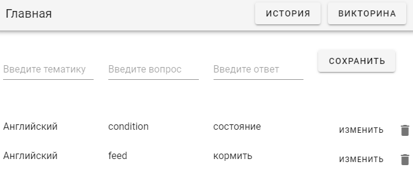

Щёлкнув по кнопке «История», пользователь переходит на соответствующую страницу. На странице представлена история ответов текущего пользователя, включая отметку верно ли дан был ответ (пользователь контролирует себя сам).


Для того, чтобы вернуться на главную страницу, нужно щёлкнуть по кнопке «Главная».

Щёлкнув по кнопке «Викторина», пользователь переходит на соответствующую страницу (рисунок 9). На этой странице пользователю отображаются все пары вопрос/ответ по одному разу, по окончанию викторины система переведёт пользователя на страницу истории ответов.

Пользователю отображается тематика вопроса, текст вопроса и кнопка «Получить ответ». По нажатию кнопки, на её месте отображается надпись с ответом на вопрос, ниже этой надписи появляются две кнопки. По нажатию на кнопку «Правильный», в системе создаётся историческая запись о том, что пользователь ответил правильно на этот вопрос в настоящий момент времени, по нажатию на «Неправильной» – в записи отмечается, что ответ был неправильным. По нажатию на любую из этих кнопок, отображается следующий вопрос.

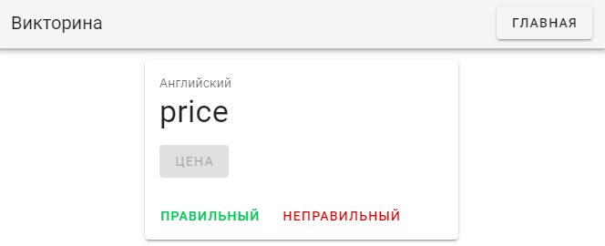

## Развёртывание приложения <a name="quizdevops"></a>
Для тестирования приложения были развёрнуты два Docker-контейнера: контейнер приложения и контейнер СУБД PostgreSQL, с которым взаимодействует приложение.
*   файл Dockerfile – содержит настройки создания Docker-образа из .jar-файла приложения;
*   файл docker-compose.yml – в нём описаны образы и настройки развёртывания;
*   файлы vars-postgres.env и vars-spring.env – в них описаны переменных среды, которые использует docker-compose при развёртывании контейнеров;
*   файлы 1-up.bat и 2-down.bat – предназначены для запуска и остановки Docker-контейнеров.

Также в приложении А представлен исходный код файла application-test.properties – этот файл содержит настройки для запуска тестов, которые будет обращаться к приложению и база данных, развёрнутым в Docker-контейнерах.

## Модульное тестирование серверной части веб-приложения <a name="quizbackend"></a>
Было реализовано модульное тестирование серверной части при помощи фреймворков JUnit и Mockito
Были разработаны 14 автоматизированных тестов. Тесты проверяют работу конечных точек (endpoints) серверной части приложения. Всего тестируемых конечных точек – 8, для каждой реализован один тест, который проверяет ответ (в формате JSON) на GET-запрос в случае корректных данных запроса. Запросы к прочим подсистемам “мокируются” – запросы к базе данных и запросы к системе авторизации – перед запросами к этим подсистемам создаются их моки.

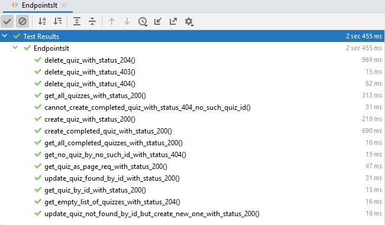

## Модульное тестирование серверной части веб-приложений <a name="lab1"></a>
В процессе выполнения заданий ознакомиться с созданием параметризованных и динамических тестов с использованием JUnit 5.

#### Заданиe
1. Реализовать простое консольное приложение калькулятор, позволяющее производить следующие арифметические операции в двоичной системе счисления: сложение, вычитание, умножение, деление, сложение по модулю 2.
2. Реализовать несколько параметризованных тестов для проверки каждой арифметической операции. Должно быть, как минимум, по одному тесту, которые принимают в качестве параметров csv и источник данных. Отдельно проверить выбрасывание исключения (assertThrows) при попытке деления на 0.
3. Подготовить yaml или csv файл с данными для тестирования. Реализовать динамические тесты на основе данных из подготовленного файла. У каждого теста должно быть читаемое имя.

#### Выполнение
Были реализованы четыре класса:
1.	Calculator.Operation – внутренний класс-перечисление. Перечисление пяти операций над двоичными числами: сложение add, вычитание subtract, умножение multiply, деление divide и “исключающее или” xor.
2.	Calculator – отвечает за операции над двоичными числами. Содержит публичный метод calculate, на вход которому подаются два целочисленных числа a и b и значение перечисления Operation. Двоичные числа
3.	CalculatorUis – содержит статические строки, обозначающие обращение к пользователю. Эти строки используются в классе CalculatorUi.
4.	CalculatorUi – класс консольного приложения, содержит точку входа в программу. Отвечает за пользовательский интерфейс.

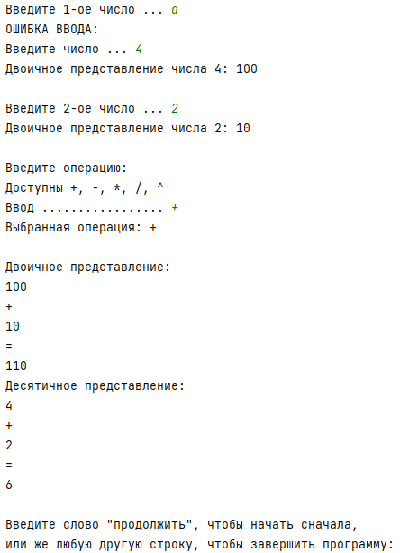

Данные для тестирования были сгенерированы на языке Python при помощи библиотеки NumPy, данные были экспортированы в формате .csv. 
Была сгенерирована таблица из семи столбцов и тысячи строк: первые два столбца соответствуют входным числам a и b, остальные столбцы соответствуют результатам операций над этими числами. Минимальное и максимальное значение a и b: -10000 и 1000. На рисунке 2 представлен часть сгенерированной таблицы.

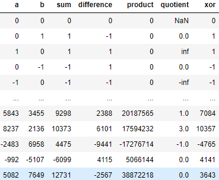

Были реализованы параметризованные тесты, проверяющие корректность результата операций над двоичными числами, в том числе тест проверяющий выброс исключения при попытке деления на ноль.
Динамический тест использует все файлы формата .csv в текущим каталоге для создания динамических тестов, которые, как и параметризованные проверяют результаты операций.

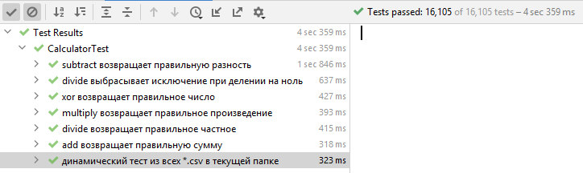

## Модульное тестирование клиентской части веб-приложения <a name="quizfrontend"></a>
Клиентская часть системы написано на фреймворке Vue.js. Модульное тестирование этой части системы реализовано с помощью фреймворка Jest.
Были протестированы три компонента подсистемы: Vue-компонент главной страницы, страницы истории и страницы игры (викторины).

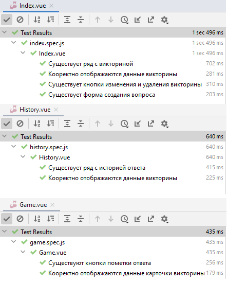

## Интеграционное тестирование веб-приложения <a name="quizapp"></a>
Было реализовано тестирование приложения через поведение.

Были разработаны три пользовательских сценария:
*   добавление викторины.feature
*   получение первой карточки.feature
*   получение списка всех викторин.feature

Фреймворк Cucumber использует класс BddSteps, в котором описаны шаги тестирования (BDD steps): шаги представляют собой некоторые действия, которые выполняет фреймворк в соответствии с пользовательским сценарием. Описание шагов – это методы, написанные на языке Java и помеченные специальными аннотациями @Before, @Given, @When и @Then, на которые обращает внимание фреймворк Cucumber.

В начале каждого сценария база данных очищается – удаляются все записи всех таблиц, и в зависимости от так называемого шага Given, который означает начальное условие, в базу данных добавляются некоторые данных. Начальные условия задаются с использование объекта класса AdminHttpClient и контроллера приложения AdminController; “пользователь” сценариев посылает HTTP-запросы приложению при помощи объекта класса UserHttpClient.

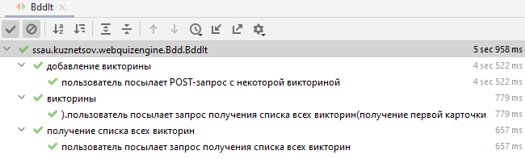

## Интеграционное тестирование веб-приложений <a name="lab2"></a>
В процессе выполнения заданий ознакомиться с фреймворком для управления миграциями баз данных Flyway и фреймворком для интеграционного тестирования Testcontainers.

#### Задание
1.	Необходимо спроектировать таблицы для хранения данных паспортов. У одного человека может быть несколько паспортов (внутренний, заграничный). Данные о просроченных и утерянных паспортах также хранятся в системе.
2.	Создать Spring Boot приложение, в котором реализовать следующие конечные точки: 
*   Получение данных о владельце паспорта по его серии и номеру.
*   Получение данных о всех паспортных данных по фамилии, имени, году рождения. Любой из этих параметров может быть не задан. Если не задан ни один параметр – необходимо вывести все паспортные данные.
*   Все DDL операции должны быть оформлены в виде миграций Flyway.
3.  Протестировать интеграционное тестирование приложения с использованием фреймворка Testcontainers. Миграции с тестовыми данными (20-30 записей) должны накатываться при запуске тестов (для каждого теста отдельно или перед запуском всех тестов).

#### Выполнение
Приложение написано на языке Java при помощи фреймворка Spring Boot и протестирована в среде разработки IntelliJ IDEA, в качестве СУБД используется PostgreSQL.
Основной частью приложения является REST-контроллер PassportRestcontroller (см. приложение А). В контроллере реализованы следующие конечные точки (endpoints): 
*   получение данных о владельце паспорта по его серии и номеру;
*   получение данных о всех паспортных данных по фамилии, имени, дате рождения; возможно получение данных по фамилии и имени, фамилии и году рождения, имени и фамилии, только по фамилии, только по имени, только по дате рождения – 7 конечных точек;
*   получение всех паспортных данных.

##### Миграция
При запуске каждого теста разработанного приложения фреймворк Flyway производит следующие миграции:
*   создаёт в базе данных таблицы citizen, foreign_passport, issuing_division, passport (таблицы соответствуют сущностям логической модели данных, представленной на рисунке 1);
*   заполняет каждую таблицу 20 записями;
*   после выполнения теста удаляет все таблицы вместе с записями.
Все данные вымышлены (ФИО, серии и номера паспортов, подразделение выдачи и др.).
При запуске приложения выполняются миграции Flyway (создаются и заполняются таблицы).

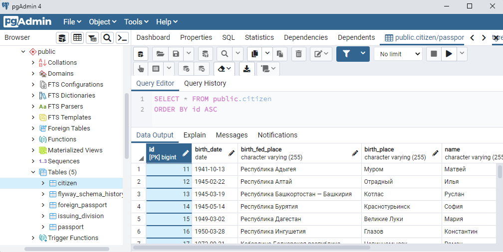

##### Тестирование
Было реализовано интеграционное тестирование приложения. До запусков тестов фреймворк Testcontainers разворачивает временный экземпляр базы данных PostgreSQL 10.18, тесты взаимодействуют с этим экземпляром. Исходный код тестирования представлен в приложении В.
Настройка и разворачивание Docker-контейнера происходит в классе BaseIt. Тесты расположены в классе PassportRestcontrollerIt (расширяет класс BaseIt).
Были разработаны 16 автоматизированных тестов. Тесты проверяют работу конечных точек. Всего тестируемых конечных точек – 8, для каждой реализованы два теста: один тест проверяет ответ (в формате JSON) на GET-запрос в случае корректных данных запроса, другой тест – в случае некорректных данных (таких данных нет в системе) в ответ должно ничего не возвращаться и HTTP-статус должен быть NO CONTENT. Перед выполнением каждого теста фреймворк Flyway выполняет миграции базы данных, после выполнения – откатывает.

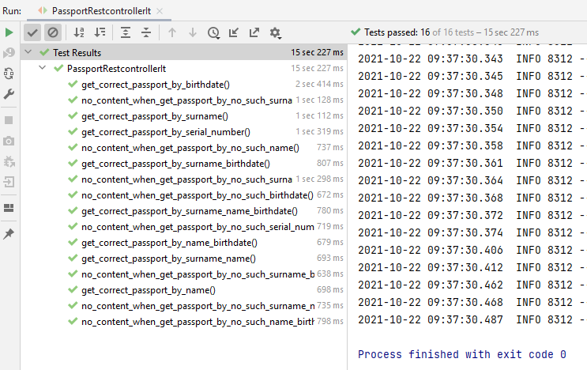

### 3. Модульное тестирование <a name="lab3"></a>
В процессе выполнения заданий ознакомиться с фреймворком DBUnit. Изучить основы модульного тестирования баз данных.

#### Задание
Расширить функциональность программы из второй лабораторной работы:
*   написать триггер, который удалит все данные о паспортах, при удалении человека из базы данных;
*   добавить функционал удаления людей;
*   написать хранимую процедуру, которая сохранит в представлении все данные о действительных паспортах;
*   написать тест, которые проверит правильность работы триггера;
*   написать тест, который проверит правильность выполнения процедуры.

#### Выполнение
Было реализовано модульное тестирование базы данных приложения. До запусков тестов фреймворк Testcontainers разворачивает временный экземпляр базы данных PostgreSQL 10.18, тесты взаимодействуют с этим экземпляром. Исходный код тестирования представлен в приложении Б.
Настройка и разворачивание Docker-контейнера происходит в классе PostgresContainer. Тесты расположены в классе DbUt (расширяет класс PostgresContainer). Были разработаны 5 автоматизированных тестов.
Три теста проверяют соответствие записей в базе данных и записей тестовых .xml-файлов. Записи таблицы citizen должны соответствовать записям файла dataset-citizen.xml, записи passport – dataset-passport.xml, записи foreign_passport – dataset-foreign-passport.xml.
Один тест проверяет, что вместе с удалением гражданина (citizen) с id = 11, в таблицах passport и foreign_passport должны удалиться записи связанные с этим гражданином – проверяет срабатывание соответствующего триггера базы данных – delete_passports_when_trig().
Последний тест проверяет создалось ли представление valid_passport_view при вызове процедуры create_valid_passport_view() – проверяется соответствуют ли записи dataset-valid-passport-view.xml записям представления valid_passport_view в базе данных.

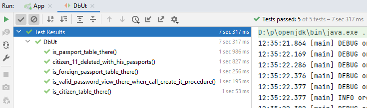

### 4. Разработка через поведение <a name="lab4"></a>
В процессе выполнения заданий познакомиться с языком Gherkin и с фреймворком Cucumber.

#### Задание 1
Разработать не менее 3 пользовательских сценария для программы, реализованной в процессе 2 и 3 лабораторных работах.

#### Задание 2
1.  Создать docker-compose.yaml файл, в нём описать образ СУБД PostgreSSL, которую необходимо развернуть. Для пароля, логина, порта использовать переменные среды.
2.  Создать .bat файл для запуска Docker-контейнера. Перед запуском Docker-контейнера устанавливаются переменные среды (например, setx POSTGRES_PORT 5432).
3.  Создать .bat файл для остановки Docker-контейнера.
4.  Создать application-test.properties файл, в котором будут прописаны настройки для запуска тестов, которые будут обращаться к базе данных, развернутой в Docker-контейнере.

#### Задание 3
1.  Описать созданные пользовательские сценарии в нотации Gherkin.
2.  Перед запуском тестов база данных должна быть пустая.
3.  Реализовать интеграционное тестирование по разработанным пользовательским сценариям с помощью фреймворка Cucumber. После прохода сценария, база данных должна возвращаться в исходное состояние.

#### Развёртывание
Для тестирования приложения были развёрнуты два Docker-контейнера: контейнер приложения и контейнер СУБД PostgreSQL, с которым взаимодействует приложение.
В приложении А представлен исходный код настроек развёртывания Docker-контейнеров:
*   файл Dockerfile – содержит настройки создания Docker-образа из .jar-файла приложения;
*   файл docker-compose.yml – в нём описаны образы и настройки развёртывания;
*   файлы vars-postgres.env и vars-spring.env – в них описаны переменных среды, которые использует docker-compose при развёртывании контейнеров;
*   файлы 1-up.bat и 2-down.bat – предназначены для запуска и остановки Docker-контейнеров.

#### Выполнение
Было реализовано тестирование приложения через поведение.

Были разработаны три пользовательских сценария:
*   получение паспорта по серии и номеру.feature
*   получение списка паспортов по фамилии и имени.feature
*   получение статуса 204 при запросе паспорта с не существующей серией и номером.feature

Фреймворк Cucumber использует класс BddSteps, в котором описаны шаги тестирования (BDD steps): шаги представляют собой некоторые действия, которые выполняет фреймворк в соответствии с пользовательским сценарием. Описание шагов – это методы, написанные на языке Java и помеченные специальными аннотациями @Before, @Given, @When и @Then, на которые обращает внимание фреймворк Cucumber.
В начале каждого сценария база данных очищается – удаляются все записи всех таблиц, и в зависимости от так называемого шага Given, который означает начальное условие, в базу данных добавляются некоторые данных. Начальные условия задаются с использование объекта класса AdminHttpClient и контроллера приложения AdminController; “пользователь” сценариев посылает HTTP-запросы приложению при помощи объекта класса UserHttpClient.

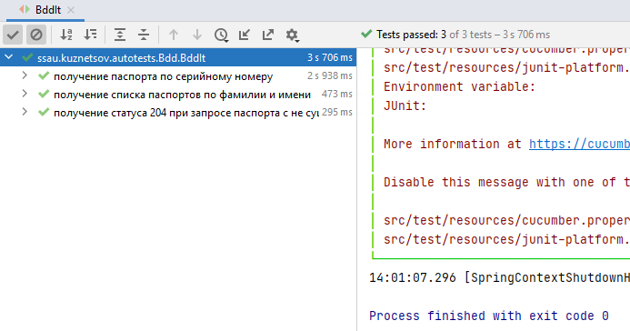

### 5. Модульное тестирование фронтэнда <a name="lab5"></a>
В процессе выполнения заданий ознакомиться с фреймворком Angular. Изучить основы модульного тестирования Angular-приложения.

#### Задание
1.	Реализовать приложение калькулятор. На странице должны присутствовать два окна ввода с надписями, в которые пользователь может ввести только целые числа. Между вводами должен располагаться dropdown-элемент с возможными значениями: разделить, сложить, умножить, вычесть. Если выбрано разделить, то во второе окно ввода не должно быть возможности ввести 0. Вводы должны быть реализованы в виде отдельного Angular-компонента. На странице также должна находиться кнопка по нажатию на которую выполнится соответствующее арифметическое действие. Результат должен быть выведен в отдельной HTML-метки.
2.	Реализовать Angular-директиву, которая окрасит результат в красный цвет, если он меньше нуля, в чёрный – если равен нулю и в зелёный – если больше нуля.
3.	Реализовать собственный pipe-фильтр, который принимает в качестве входного значения количество знаков после запятой. Применить реализованный pipe-фильтр к результату
4.	Написать модульные тесты для директивы, фильтра и для каждого компонента. В качестве фреймворка для тестирования можно использовать Jasmine или Jest.

#### Приложение
Было разработано одностраничное веб-приложение калькулятор при помощи фреймворка Angular.

На странице присутствуют два окна ввода с надписями, в которые пользователь может ввести только целые числа. Между вводами располагается dropdown-элемент с возможными значениями: разделить, сложить, умножить, вычесть. Если выбрано разделить, то во второе окно ввода невозможно ввести число 0. Вводы реализованы в виде отдельного Angular-компонента. На странице находится кнопка, по нажатию на которую выполнится соответствующее арифметическое действие. Результат выводится в отдельной HTML-метке.

Была реализована Angular-директива, которая окрашивает результат вычисления калькулятора в красный цвет, если он меньше нуля, в чёрный – если равен нулю и в зелёный – если больше нуля.

Был реализован pipe-фильтр, который принимает в качестве входного значения количество знаков после запятой. Реализованный pipe-фильтр применяется к результату.

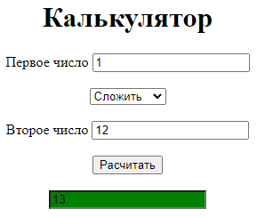

#### Выполнение
Были реализованы модульные тесты для директивы, фильтра и для каждого компонента. В качестве фреймворка для тестирования использовался Jasmine.

Модульные тесты главного компонента:
*   сложение 41 + 19 = 60;
*   вычитание -92 - 93 = 1;
*   умножение 52 * 54 = 2808;
*   деление 74 : 2 = 37;
*   наличие вывода расчёта.

Модульные тесты компонента, содержащего окна ввода чисел:
*   ввод букв в первое окно ввода – ввод невозможен;
*   ввод числа 100 в первое окно – корректный ввод;
*   ввод букв в второе окно ввода – ввод невозможен;
*   ввод числа 100 во второе окно – корректный ввод;
*   ввод нуля во второе окно при делении – ввод невозможен;
*   наличие кнопки выполнения расчёта.

Модульные тесты директивы:
*   цвет фона красный при вводе -1 (ввод отрицательного числа);
*   цвет фона чёрный при вводе 0 (ввод нуля);
*   цвет фона зелёный при вводе 1 (ввод положительного числа).

Модульные тесты pipe-фильтра:
*   округление числа 1.23999999 до двух знаков после точки – правильный ответ 1.24;
*   округление числа 373.532123 до одного знака после точки – правильный ответ 373.5.

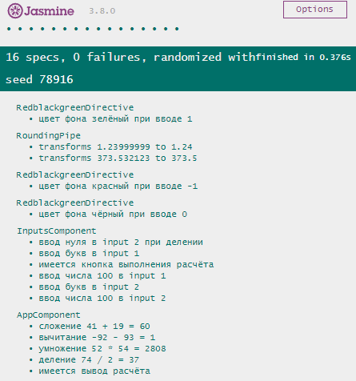

### 6. Сквозное тестирование <a name="lab6"></a>
В процессе выполнения заданий ознакомиться с библиотеками для сквозного тестирования фронтэнд-приложений. За основу взять приложение из 5 лабораторной работы. В качестве фреймворка для тестирования можно использовать Cypress или Protractor.

#### Задание
Необходимо создать несколько UI-тестов:
1.	Проверить, что наличия на странице полей ввода, dropdown и кнопки расчёта.
2.	Проверить, что корректно работают все арифметические действия.
3.	Проверить, что в поля ввода можно ввести только цифры.
4.	Проверить, что при выборе деления во второе поле ввода нельзя ввести 0.
5.	Проверить, цвета результата в зависимости от знака.

#### Выполнение
Были реализованы тесты для сквозного тестирования разработанного калькулятора. В качестве фреймворка для тестирования использовался Cypress.
Сквозные тесты приложения:
*   существует первое окно ввода;
*   существует второе окно ввода;
*   существует выпадающий список операций;
*   существует кнопка расчёта;
*   корректный ответ сложения 41 + 19 = 60;
*   корректный ответ вычитания -92 - 93 = -185;
*   корректный ответ вычитания умножения 52 * 54 = 2808;
*   корректный ответ деления 74 : 2 = 37;
*   пустая строка при вводе букв в ввод 1;
*   пустая строка при вводе букв в ввод 2;
*   возможно ввести 0 во второй ввод при операции сложения;
*   невозможно ввести 0 во второй ввод при операции деления;
*   зелёный фон при ответе положительном числе (1 + 1 = 1);
*   чёрный фон при ответе нуле (0 + 0 = 0);
*   красный фон при отрицательном ответе (1 - 5 = -4).

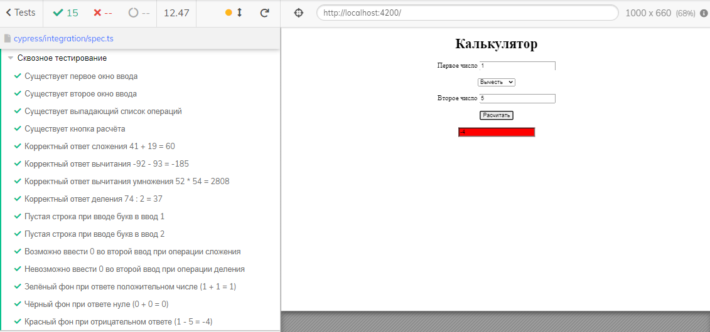
